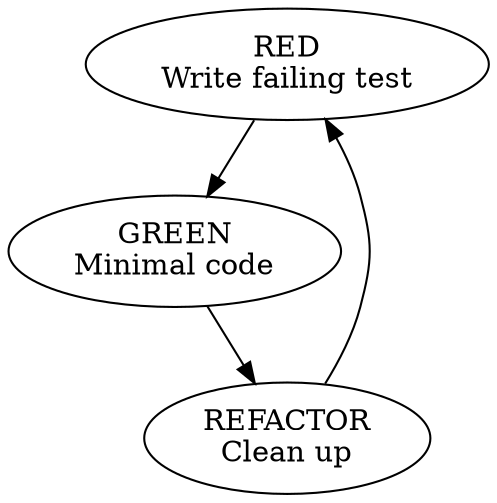
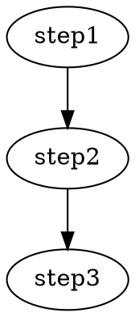

# cc10x Prompt Engineering Improvements

## Research Summary

Analyzed best-in-class prompt engineering from:
- **obra/superpowers** (448 stars) - Comprehensive workflow skills
- **EveryInc/compound-engineering-plugin** (3k stars) - 27 agents, 19 commands, 13 skills
- **PatrickJS/awesome-cursorrules** (36k stars) - 150+ cursor rules

---

## Gap Analysis: cc10x vs Best-in-Class

### 1. Missing "Iron Law" Concept

**Superpowers has:**
```
NO COMPLETION CLAIMS WITHOUT FRESH VERIFICATION EVIDENCE
NO PRODUCTION CODE WITHOUT A FAILING TEST FIRST
NO FIXES WITHOUT ROOT CAUSE INVESTIGATION FIRST
```

**cc10x has:** Generic process descriptions without memorable rules.

**Impact:** AI doesn't have a clear, unbreakable constraint to anchor behavior.

---

### 2. Missing Anti-Rationalization Tables

**Superpowers has:**
```
| Excuse | Reality |
| "Too simple to test" | Simple code breaks. Test takes 30 seconds. |
| "I'll test after" | Tests passing immediately prove nothing. |
| "Just this once" | No exceptions |
```

**cc10x has:** Nothing countering AI excuses.

**Impact:** AI finds loopholes and rationalizes shortcuts.

---

### 3. Missing "Red Flags - STOP" Section

**Superpowers has:**
```
If you catch yourself thinking:
- "Quick fix for now, investigate later"
- "Just try changing X and see if it works"
- "I don't fully understand but this might work"

ALL of these mean: STOP. Return to Phase 1.
```

**cc10x has:** No explicit halt conditions.

**Impact:** AI continues bad patterns without self-correcting.

---

### 4. Missing Gate Functions

**Superpowers has:**
```
BEFORE claiming any status:
1. IDENTIFY: What command proves this claim?
2. RUN: Execute the FULL command
3. READ: Full output, check exit code
4. VERIFY: Does output confirm the claim?
5. ONLY THEN: Make the claim

Skip any step = lying, not verifying
```

**cc10x has:** Process steps without enforcement gates.

**Impact:** AI skips verification steps without realizing.

---

### 5. Missing Visual Diagrams

**Superpowers has:** Graphviz/dot diagrams showing workflow:


**cc10x has:** Text-only descriptions.

**Impact:** Complex processes harder to follow.

---

### 6. Missing Real-World Impact Stats

**Superpowers has:**
```
From debugging sessions:
- Systematic approach: 15-30 minutes to fix
- Random fixes approach: 2-3 hours of thrashing
- First-time fix rate: 95% vs 40%
```

**cc10x has:** No evidence of effectiveness.

**Impact:** Less compelling, AI may not prioritize following the process.

---

### 7. Missing Phase-Based Structure

**Superpowers systematic-debugging:**
- Phase 1: Root Cause Investigation (4 steps)
- Phase 2: Pattern Analysis (4 steps)
- Phase 3: Hypothesis and Testing (4 steps)
- Phase 4: Implementation (5 steps)

**cc10x debugging-patterns:** Flat process without phases.

**Impact:** Less systematic, easier to skip steps.

---

### 8. Missing Expert Identity

**Cursorrules pattern:**
```
You are an expert in TypeScript, Node.js, Next.js 14 App Router,
React, Vite, Wagmi v2, Shadcn UI, Radix UI, and Tailwind Aria.
```

**cc10x has:** No expert identity establishment.

**Impact:** AI doesn't adopt authoritative voice.

---

### 9. Missing Intake/Routing Pattern

**Compound-engineering:**
```
What are you working on?
1. **Controllers** - REST mapping, concerns
2. **Models** - Concerns, state records
3. **Views** - Turbo, Stimulus, CSS
4. **Architecture** - Routing, auth, jobs
5. **Code Review** - Review against style
```

**cc10x has:** No intake questions.

**Impact:** AI doesn't clarify needs before proceeding.

---

### 10. Missing Success Criteria

**Compound-engineering:**
```
Code follows DHH style when:
- Controllers map to CRUD verbs
- Models use concerns for horizontal behavior
- State is tracked via records, not booleans
- No unnecessary service objects
```

**cc10x has:** No clear "done right" definition.

**Impact:** Ambiguous quality bar.

---

### 11. Missing Psychological Hooks

**Superpowers:**
```
"Claiming work is complete without verification is dishonesty, not efficiency."

"If you haven't run the verification command in this message,
you cannot claim it passes."

"Core principle: Evidence before claims, always.
Violating the letter of this rule is violating the spirit."
```

**cc10x has:** Dry process descriptions.

**Impact:** Less emotionally compelling, easier to ignore.

---

### 12. Missing Subagent Orchestration

**Superpowers subagent-driven-development:**
- Fresh subagent per task (no context pollution)
- Two-stage review: spec compliance THEN code quality
- Implementer → Spec Reviewer → Code Quality Reviewer
- Review loops until approved

**cc10x has:** Basic router without sophisticated orchestration.

**Impact:** Less effective at complex multi-step tasks.

---

## Improvement Plan

### Phase 1: Add Core Prompt Engineering Patterns (Priority: HIGH)

**1.1 Add Iron Laws to each skill:**
```markdown
## The Iron Law

```
NO [VIOLATION] WITHOUT [REQUIREMENT] FIRST
```

[Single memorable rule that anchors the entire skill]
```

**1.2 Add Anti-Rationalization Tables:**
```markdown
## Common Rationalizations

| Excuse | Reality |
| ------ | ------- |
| "[common shortcut]" | [why it fails] |
```

**1.3 Add Red Flags - STOP Section:**
```markdown
## Red Flags - STOP

If you catch yourself:
- [bad pattern 1]
- [bad pattern 2]

**ALL of these mean: STOP. [corrective action]**
```

**1.4 Add Gate Functions:**
```markdown
## The Gate Function

BEFORE [action]:
1. [verification step]
2. [verification step]
3. [verification step]
4. ONLY THEN: [action]

Skip any step = [consequence]
```

---

### Phase 2: Restructure Skills (Priority: MEDIUM)

**2.1 Add Phase-Based Structure:**
```markdown
## The Four Phases

### Phase 1: [Name]
You MUST complete this before Phase 2.
[steps]

### Phase 2: [Name]
[steps]
```

**2.2 Add Visual Diagrams:**
```markdown
## Process Flow


```

**2.3 Add Real-World Impact:**
```markdown
## Why This Matters

From [N] sessions:
- [good approach]: [metric]
- [bad approach]: [metric]
```

---

### Phase 3: Add New Skills (Priority: MEDIUM)

**3.1 Brainstorming Skill** (restore from superpowers pattern):
- One question at a time
- Multiple choice preferred
- Incremental validation
- Design document output

**3.2 Writing-Plans Skill** (from superpowers):
- Bite-sized task granularity (2-5 minutes)
- Complete code in plan
- Exact file paths
- TDD baked in

**3.3 Subagent-Driven-Development** (from superpowers):
- Fresh subagent per task
- Two-stage review (spec then quality)
- Review loops until approved

---

### Phase 4: Enhance Existing Skills (Priority: HIGH)

#### verification-before-completion
- Add Iron Law: "NO COMPLETION CLAIMS WITHOUT FRESH VERIFICATION EVIDENCE"
- Add Gate Function with 5-step verification
- Add anti-rationalization table
- Add red flags section
- Add psychological hook: "Claiming done without verification is dishonesty"

#### test-driven-development
- Add Iron Law: "NO PRODUCTION CODE WITHOUT A FAILING TEST FIRST"
- Add "Write code before test? DELETE IT. Start over."
- Add visual TDD cycle diagram
- Add anti-rationalization table for "I'll test after"
- Add real-world impact stats

#### debugging-patterns
- Add Iron Law: "NO FIXES WITHOUT ROOT CAUSE INVESTIGATION FIRST"
- Restructure into 4 phases
- Add "3+ fixes failed? Question the architecture"
- Add diagnostic instrumentation patterns
- Add red flags for "quick fix" thinking

#### planning-patterns
- Add intake questions pattern
- Add success criteria section
- Add bite-sized task granularity guidance
- Add plan document header template

#### code-review-patterns
- Add two-stage review (spec compliance THEN code quality)
- Add severity levels (Critical blocks, Important notes)
- Add review loop requirement

#### code-generation
- Add expert identity pattern
- Add key principles section
- Add dependencies section
- Add success criteria

#### architecture-patterns
- Add intake/routing pattern
- Add quick reference section
- Add reference index for deep dives

#### frontend-patterns
- Add expert identity for frontend
- Add success criteria
- Add key conventions

---

## Implementation Priority

| Priority | Skill | Key Addition |
| -------- | ----- | ------------ |
| 1 | verification-before-completion | Iron Law + Gate Function |
| 2 | test-driven-development | Iron Law + Anti-rationalization |
| 3 | debugging-patterns | 4-Phase Structure |
| 4 | cc10x-router | Subagent orchestration |
| 5 | planning-patterns | Bite-sized tasks + Templates |
| 6 | code-review-patterns | Two-stage review |
| 7 | All skills | Red Flags sections |
| 8 | All skills | Visual diagrams |

---

## References

- https://github.com/obra/superpowers
- https://github.com/EveryInc/compound-engineering-plugin
- https://github.com/PatrickJS/awesome-cursorrules
