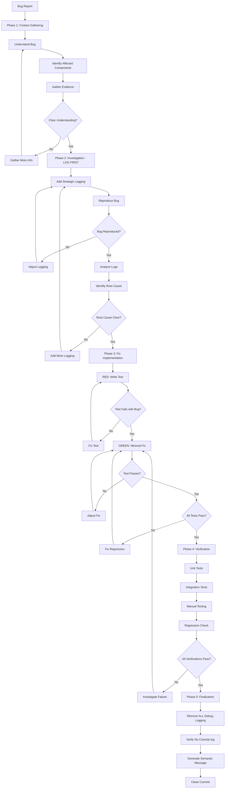

# Bug Fix Command

Fix bugs systematically using the LOG FIRST pattern - always add logging and reproduce the issue before making any code changes. This command ensures minimal, targeted fixes with comprehensive tests that prevent regressions.

Perfect for debugging production issues, fixing reported bugs, and resolving unexpected behavior.

## What This Does

This command orchestrates a 5-phase debugging workflow:

- **Phase 1: Context Gathering** - Understand the bug, affected components, and expected behavior
- **Phase 2: Investigation (LOG FIRST)** - Add logging to reproduce and understand root cause BEFORE fixing
- **Phase 3: Fix Implementation** - Minimal, targeted change with test that proves the fix
- **Phase 4: Verification** - Ensure fix works AND doesn't break anything else
- **Phase 5: Finalization** - Clean commit with semantic message and cleanup of debug logging

**Key Features:**
- ✅ **LOG FIRST Pattern** - Always add logging before fixing (prevents blind fixes)
- ✅ **Root Cause Analysis** - Understand why, not just what
- ✅ **Minimal Changes** - Smallest possible fix (reduces risk)
- ✅ **Test-Driven** - Write test that reproduces bug, then fix until test passes
- ✅ **Regression Prevention** - All existing tests must still pass
- ✅ **No Debug Code Left Behind** - Cleanup all console.log, debugger statements

## When to Use

Use `/bug-fix` when you need to:

- **Fix reported bugs** - Users or tests reporting unexpected behavior
- **Debug production issues** - Something is broken in production
- **Resolve test failures** - Tests failing after changes
- **Fix regressions** - Feature that worked before now broken
- **Investigate errors** - Understanding why errors are occurring

**Don't use when:**
- Building new features (use `/feature-build` instead)
- Planning architecture (use `/feature-plan` instead)
- Reviewing code quality (use `/review` instead)
- Making improvements to working code (use `/feature-build` for enhancements)

## Workflow

### Workflow Visualization



### Phase 1: Context Gathering

**Goal:** Understand the bug completely before touching any code

**Process:**

1. **Understand the Bug**
   - What is the expected behavior?
   - What is the actual behavior?
   - How critical is this bug? (severity/priority)
   - When did it start occurring?

2. **Identify Affected Components**
   - Which files/functions are involved?
   - What dependencies might be affected?
   - Is this frontend, backend, database, or multiple layers?

3. **Gather Evidence**
   - Error messages and stack traces
   - User reports or bug tickets
   - Logs from production
   - Steps to reproduce

4. **Form Initial Hypothesis**
   - What might be causing this?
   - Multiple possible causes?
   - Is this a code bug, config issue, or data problem?

**Quality Gate:** Clear understanding of bug symptoms and affected areas

**Output Example:**
```markdown
## Bug Context

**Reported Issue:**
User cannot submit form - clicking "Submit" does nothing

**Expected Behavior:**
Form should validate, show loading state, submit data, show success message

**Actual Behavior:**
Button click has no effect, no error messages, console is silent

**Severity:** HIGH (blocks critical user flow)

**Affected Components:**
- Frontend: src/components/ContactForm.tsx
- Backend: src/routes/contact.ts (maybe?)
- Possible causes: Event handler not attached, validation failing silently, API error

**Evidence:**
- User report: "Submit button doesn't work"
- Steps to reproduce: Fill form, click Submit, nothing happens
- Browser: Chrome 118, React 18

**Initial Hypothesis:**
1. Event handler might not be attached to button
2. Validation might be failing without error UI
3. API call might be failing silently
```

---

### Phase 2: Investigation (LOG FIRST Pattern)

**Goal:** Add logging to reproduce and understand root cause BEFORE making any fixes

**CRITICAL RULE:** No fixes until you've added logging and seen the problem

**Process:**

1. **Add Strategic Logging**
   ```javascript
   // Add logging at key points:
   console.log('[ContactForm] Component mounted');
   console.log('[ContactForm] Form data:', formData);
   console.log('[ContactForm] Validation result:', validationResult);
   console.log('[ContactForm] Submit handler called');
   console.log('[ContactForm] API call starting...');
   ```

2. **Reproduce the Bug**
   - Follow steps to reproduce
   - Watch console output
   - Note where logging stops (that's where bug is)
   - Check for errors that weren't visible before

3. **Narrow Down Root Cause**
   - Add more detailed logging where needed
   - Check variable values at crash point
   - Verify assumptions with logging
   - Test edge cases

4. **Identify Root Cause**
   - What specific line causes the issue?
   - Why does it fail?
   - What conditions trigger it?

**Quality Gate:** Root cause identified with certainty, proven by logs

**Real Example:**
```
Investigation Results:

✅ Added logging to ContactForm.tsx
✅ Reproduced bug locally

Console output:
[ContactForm] Component mounted
[ContactForm] Form data: { name: "John", email: "john@example.com", message: "Test" }
[ContactForm] Validation result: { valid: true }
[ContactForm] Submit handler called
[ERROR] Cannot read property 'post' of undefined

**ROOT CAUSE FOUND:**
Line 45 in ContactForm.tsx: `api.post('/contact', formData)`
Problem: `api` is undefined because import statement is wrong:
  Current: import { api } from '../utils/api'
  Should be: import api from '../utils/api'  (default export)

**Why it happened:**
Someone changed API module to default export but didn't update this import

**Impact:**
This affects ALL forms using the same broken import pattern
```

---

### Phase 3: Fix Implementation

**Goal:** Minimal, targeted fix with test that proves it works

**Process:**

1. **Write Test That Reproduces Bug** (TDD for bugs)
   ```javascript
   describe('ContactForm bug fix', () => {
     it('should submit form when valid data provided', async () => {
       render(<ContactForm />);
       
       fireEvent.change(screen.getByLabelText('Name'), {
         target: { value: 'John Doe' }
       });
       fireEvent.change(screen.getByLabelText('Email'), {
         target: { value: 'john@example.com' }
       });
       fireEvent.change(screen.getByLabelText('Message'), {
         target: { value: 'Test message' }
       });
       
       fireEvent.click(screen.getByText('Submit'));
       
       // This SHOULD pass but currently fails (reproduces bug)
       await waitFor(() => {
         expect(mockApi.post).toHaveBeenCalledWith('/contact', {
           name: 'John Doe',
           email: 'john@example.com',
           message: 'Test message'
         });
       });
     });
   });
   ```

2. **Run Test - Confirm It Fails**
   ```
   ❌ Test run: FAILED
   Error: api.post is not a function
   
   ✅ Test correctly reproduces the bug
   ```

3. **Implement Minimal Fix**
   ```javascript
   // BEFORE (broken):
   import { api } from '../utils/api';
   
   // AFTER (fixed):
   import api from '../utils/api';
   ```

4. **Run Test - Confirm It Passes**
   ```
   ✅ Test run: PASSED
   ContactForm bug fix
     ✓ should submit form when valid data provided (145ms)
   ```

5. **Run ALL Tests - Confirm Nothing Broke**
   ```
   ✅ All tests: PASSED (127/127)
   ```

6. **Verify Fix Manually**
   - Test in browser
   - Follow original reproduction steps
   - Confirm bug is gone
   - Test edge cases

**Quality Gate:** Test passes, all existing tests still pass, manual verification successful

**Real Example:**
```
Fix Implementation Complete

**Change Made:**
File: src/components/ContactForm.tsx
Line: 3
- import { api } from '../utils/api';
+ import api from '../utils/api';

**Lines Changed:** 1
**Complexity:** Minimal (import fix)

**Test Results:**
✅ New test passes (reproduces bug, then passes with fix)
✅ All 127 existing tests pass
✅ No regressions detected

**Manual Verification:**
✅ Form submits successfully
✅ Success message displays
✅ Data reaches backend
✅ Edge cases work (empty fields rejected, etc.)
```

---

### Phase 4: Verification

**Goal:** Comprehensive verification that fix works and doesn't break anything

**Process:**

1. **Unit Test Verification**
   - New test for this bug passes
   - All existing unit tests pass
   - Coverage maintained or improved

2. **Integration Test Verification**
   - Full user flow works end-to-end
   - Related features still work
   - No unexpected side effects

3. **Regression Testing**
   - Run full test suite
   - Check for any new failures
   - Verify fix doesn't break edge cases

4. **Manual Testing**
   - Test the reported bug scenario
   - Test variations and edge cases
   - Test in different browsers if frontend
   - Test with different data if backend

5. **Code Review (Self)**
   - Is fix minimal? (not over-engineered)
   - Is fix clear? (other devs will understand)
   - Are all debug logs removed?
   - Is code clean and linted?

**Quality Gate:** All tests pass, bug is fixed, no regressions, code is clean

**Output Example:**
```markdown
## Verification Results

### Unit Tests ✅
- New test: PASSED
- Existing tests: 127/127 PASSED
- Coverage: 89% (maintained)

### Integration Tests ✅
- Contact form flow: PASSED
- Newsletter form: PASSED (uses same api import)
- Login form: PASSED (uses same api import)

### Regression Check ✅
- No new test failures
- All related components verified

### Manual Testing ✅
- Original bug scenario: FIXED
- Empty form submission: Correctly rejected
- Invalid email: Correctly rejected
- Network error handling: Works
- Tested in Chrome, Firefox, Safari: All work

### Code Quality ✅
- Debug logs removed
- Code linted and clean
- Fix is minimal (1 line change)
- No side effects

**VERIFICATION COMPLETE:** Ready for commit
```

---

### Phase 5: Finalization

**Goal:** Clean commit with bug fix and cleanup

**Process:**

1. **Remove All Debug Logging**
   - Remove all console.log statements added during investigation
   - Remove any debugger statements
   - Remove any temporary test code

2. **Final Code Review**
   - Check diff to ensure only fix is included
   - No unintended changes
   - No commented-out code

3. **Stage Changes**
   - Stage fix files
   - Stage new test files
   - Verify git diff

4. **Generate Semantic Commit**
   ```
   Format: fix(<scope>): <subject>
   
   Example:
   fix(contact-form): correct API import to fix form submission
   
   - Changed named import to default import for API client
   - Added test to prevent regression
   - Fixes issue where submit button did nothing
   
   Fixes #123
   ```

5. **Commit and Verify**
   - Commit with descriptive message
   - Run tests one final time
   - Push to branch

**Quality Gate:** Clean commit with fix, test, and no debug code

**Output Example:**
```markdown
## Bug Fix Complete

**Commit:** fix(contact-form): correct API import to fix form submission

**Changes:**
- Modified: src/components/ContactForm.tsx (1 line)
- Added: src/components/__tests__/ContactForm.bug-fix.test.tsx (45 lines)

**Statistics:**
- Lines changed: 1 (fix)
- Lines added: 45 (test)
- Net change: +46 lines

**Tests:**
- New tests: 1
- Total tests: 128
- All passing: ✅

**Verification:**
- Bug fixed: ✅
- Regressions: None
- Debug code removed: ✅
- Linting: Clean

**Impact:**
- Affected users: All users using contact form
- Severity: HIGH → RESOLVED
- Related bugs: None (isolated issue)

**Next Steps:**
1. Push: git push origin fix/contact-form-submission
2. Create PR with "Fixes #123" in description
3. Deploy to staging for QA verification
4. Cherry-pick to hotfix branch if urgent
```

---

## Examples

### Example 1: Form Submission Bug

**Input:**
```bash
/bug-fix Contact form submit button does nothing when clicked
```

**Process:**
```
Phase 1: Context Gathering
✅ Bug understood: Form submit has no effect
✅ Severity: HIGH (blocks critical flow)
✅ Affected: src/components/ContactForm.tsx
✅ Hypothesis: Event handler issue or API call problem

Phase 2: Investigation (LOG FIRST)
🔍 Adding logging to ContactForm...
🔍 Reproducing bug...
📋 Logs show: Import error on API client
✅ Root cause: Wrong import statement

Phase 3: Fix
🔴 Writing test that reproduces bug...
✅ Test fails (reproduces bug)
🟢 Fixing import statement...
✅ Test passes
✅ All 127 tests pass

Phase 4: Verification
✅ Unit tests: PASS
✅ Integration tests: PASS
✅ Manual test: Form submits correctly
✅ Regression check: No issues

Phase 5: Finalization
✅ Debug logs removed
✅ Committed: fix(contact-form): correct API import

**Time:** 45 minutes
**Impact:** HIGH bug resolved
```

---

### Example 2: Database Query Returns Wrong Data

**Input:**
```bash
/bug-fix User dashboard showing other user's private data
```

**Process:**
```
Phase 1: Context
✅ Bug: CRITICAL SECURITY - Data leak
✅ Severity: CRITICAL
✅ Affected: src/routes/dashboard.ts, src/models/user.ts
✅ Hypothesis: Missing WHERE clause in query

Phase 2: Investigation
🔍 Adding logging to dashboard route...
🔍 Logs show: Query returns all users, not filtered by userId
📋 SQL: SELECT * FROM users (missing WHERE user_id = ?)
✅ Root cause: Query not filtering by authenticated user

Phase 3: Fix
🔴 Writing test: Should only return current user's data...
✅ Test fails (security bug reproduced)
🟢 Adding WHERE clause with req.user.id...
✅ Test passes
✅ All 156 tests pass

Phase 4: Verification
✅ Unit tests: Only current user's data returned
✅ Integration tests: Cannot access other user data
✅ Security audit: No other leaks found
✅ Manual test: Private data properly scoped

Phase 5: Finalization
✅ Debug logs removed
✅ Committed: fix(security): scope dashboard data to authenticated user

**Time:** 1.5 hours
**Impact:** CRITICAL security bug fixed
**Action:** Emergency deploy to production
```

---

### Example 3: Performance Issue (Slow Loading)

**Input:**
```bash
/bug-fix Product list page takes 30 seconds to load
```

**Process:**
```
Phase 1: Context
✅ Bug: Performance - Page extremely slow
✅ Severity: HIGH (bad UX)
✅ Affected: src/routes/products.ts
✅ Hypothesis: N+1 query problem or missing index

Phase 2: Investigation
🔍 Adding performance logging...
🔍 Logs show: 500 separate DB queries (one per product)
📋 Problem: Loading reviews for each product individually
✅ Root cause: N+1 query - not using JOIN

Phase 3: Fix
🔴 Writing test: Should complete in < 1 second...
✅ Test fails (takes 30s, reproduces issue)
🟢 Rewriting query with JOIN...
✅ Test passes (loads in 200ms)
✅ All 98 tests pass

Phase 4: Verification
✅ Performance: 30s → 200ms (150x faster!)
✅ Data accuracy: Same results as before
✅ All tests: PASS
✅ Manual test: Page loads instantly

Phase 5: Finalization
✅ Debug logs removed
✅ Committed: fix(performance): eliminate N+1 query in product list

**Time:** 2 hours
**Impact:** 150x performance improvement
```

---

## Best Practices

### 1. **Always LOG FIRST**
Never make changes before adding logging and reproducing the bug. Blind fixes usually create more bugs.

### 2. **Write Test That Reproduces Bug**
If you can't write a test that fails, you don't understand the bug well enough.

### 3. **Make Minimal Changes**
Fix only what's broken. Don't refactor, don't add features, don't clean up unrelated code.

### 4. **Verify No Regressions**
Run ALL tests, not just the new one. Fixes that break other things aren't fixes.

### 5. **Test Edge Cases**
Bug might be symptom of larger issue. Test variations to ensure complete fix.

### 6. **Remove Debug Code**
All console.log and debugger statements must be removed before commit.

### 7. **Document Root Cause**
Commit message should explain why bug occurred, not just what was changed.

---

## Common Issues

### Issue: Can't reproduce the bug

**Symptom:** Following reported steps doesn't trigger the bug

**Cause:** Missing context, environment difference, or incomplete report

**Solution:**
1. Gather more information from reporter
2. Check environment differences (dev vs prod, browser versions, data)
3. Add logging anyway and ask reporter to trigger bug with logging enabled
4. Try edge cases (empty data, special characters, timing issues)

---

### Issue: Multiple possible causes

**Symptom:** Several things could be causing the bug

**Cause:** Complex interaction or insufficient investigation

**Solution:**
1. Add logging to all suspected areas
2. Use process of elimination (comment out code sections)
3. Binary search: Disable half the code, see if bug persists
4. Don't guess - prove with logging

---

### Issue: Fix breaks other tests

**Symptom:** Fix works but other tests fail

**Cause:** Fix was too broad or changed shared behavior

**Solution:**
1. Review what tests are failing
2. Understand why they expect different behavior
3. Either:
   - Make fix more targeted (only affects bug case)
   - Update tests if new behavior is correct
   - Fix is wrong - need different approach

---

### Issue: Fix works in dev but not production

**Symptom:** Bug fixed locally but still occurs in production

**Cause:** Environment differences (config, data, dependencies)

**Solution:**
1. Check environment-specific configs
2. Verify same code version deployed
3. Check production logs for different error
4. Test in staging environment that mirrors production
5. Add logging to production (if safe) to debug

---

### Issue: Bug only occurs sometimes

**Symptom:** Intermittent bug, hard to reproduce

**Cause:** Race condition, timing issue, or data-dependent

**Solution:**
1. Add extensive logging including timestamps
2. Test with different timing (fast/slow actions)
3. Check for asynchronous operations without await
4. Test with various data (empty, large, special chars)
5. Load test (might be concurrency issue)

---

## Related Commands

### `/feature-build`
**Use instead of** `/bug-fix` when adding new functionality.

**When to use which:**
- Existing code broken → `/bug-fix`
- New functionality needed → `/feature-build`

---

### `/review`
**Use after** major bug fixes to ensure no issues introduced.

**Workflow:**
```bash
/bug-fix User dashboard shows wrong data
/review src/routes/dashboard.ts  # Security, quality check
```

---

### `/feature-plan`
**Use if** bug reveals missing feature or architecture problem.

**Example:**
```bash
/bug-fix Rate limiting not working
# Discover: We don't have rate limiting at all!
/feature-plan Add comprehensive rate limiting system
/feature-build Implement rate limiting
```

---

## LOG FIRST Pattern Deep Dive

### Why LOG FIRST?

**Problem:** Developers often jump straight to "fixing" without understanding:
- ❌ Fix the symptom, not the cause
- ❌ Introduce new bugs
- ❌ Over-engineer the solution
- ❌ Can't verify the fix works

**Solution:** LOG FIRST pattern:
1. Add logging
2. Reproduce bug
3. Understand exactly what's happening
4. Fix with confidence
5. Remove logging

### What to Log

**Strategic logging points:**

```javascript
// 1. Entry points
console.log('[Function] Called with:', arguments);

// 2. Key decisions
console.log('[Function] Condition met:', condition, 'value:', value);

// 3. State changes
console.log('[Function] Before:', beforeState);
// ... mutation ...
console.log('[Function] After:', afterState);

// 4. External calls
console.log('[Function] Calling API with:', payload);
// ... await api.call() ...
console.log('[Function] API returned:', response);

// 5. Exit points
console.log('[Function] Returning:', result);
```

### Example: LOG FIRST in Action

**Bug:** Login fails with "Network error" even though network is fine

**Without LOG FIRST (bad):**
```javascript
// Developer guesses: "Probably CORS issue"
// Adds CORS headers everywhere
// Bug still occurs
// Wastes 2 hours
```

**With LOG FIRST (good):**
```javascript
// Developer adds logging:
console.log('[Login] Starting login for:', email);
console.log('[Login] Calling API:', apiUrl);
console.log('[Login] Headers:', headers);

// Runs code, sees logs:
// [Login] Starting login for: user@example.com
// [Login] Calling API: undefined/api/login  <-- AHA!
// [Login] Headers: {...}

// ROOT CAUSE: apiUrl is undefined
// FIX: Check environment variable loading
// Time spent: 15 minutes
```

---

## Quality Gates Summary

### Phase 1: Context
- ✅ Bug symptoms clear
- ✅ Affected components identified
- ✅ Severity assessed

### Phase 2: Investigation
- ✅ Logging added
- ✅ Bug reproduced with logs
- ✅ Root cause identified with certainty

### Phase 3: Fix
- ✅ Test written that reproduces bug
- ✅ Test fails (proves it reproduces bug)
- ✅ Minimal fix implemented
- ✅ Test passes
- ✅ ALL tests pass

### Phase 4: Verification
- ✅ Unit tests pass
- ✅ Integration tests pass
- ✅ No regressions
- ✅ Manual verification successful
- ✅ Edge cases tested

### Phase 5: Finalization
- ✅ All debug logging removed
- ✅ Code is clean
- ✅ Semantic commit message
- ✅ No unintended changes

---

## Success Metrics

A successful bug fix has:

- ✅ **Root cause understood** - Not just guessing
- ✅ **Minimal change** - Only what's necessary
- ✅ **Test that proves fix** - Reproduces bug, then passes
- ✅ **No regressions** - All existing tests still pass
- ✅ **Manual verification** - Actually tested the fix
- ✅ **Clean code** - No debug artifacts
- ✅ **Clear documentation** - Commit explains why

**If missing any of these, the bug fix is incomplete.**

---

## Notes

- LOG FIRST saves hours of guessing
- Minimal fixes reduce risk and review time
- Tests prevent the same bug from returning
- Don't mix bug fixes with refactoring (separate concerns)
- Critical bugs might need hotfix process (skip some gates if necessary, fix them later)
- Keep fix focused - if you discover other issues, file separate bugs

