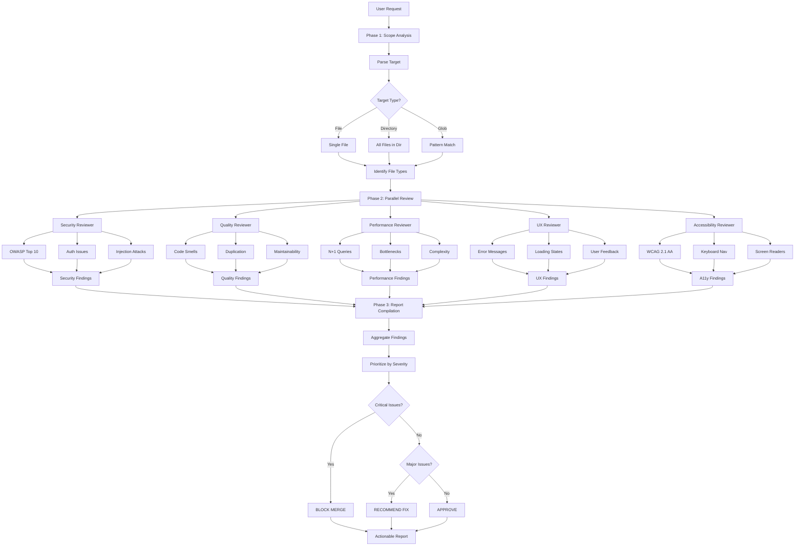

# Code Review Command

Perform comprehensive multi-dimensional code review with parallel analysis across five critical dimensions: security, quality, performance, UX, and accessibility. Get actionable feedback with prioritized recommendations before merging code.

Perfect for pre-PR reviews, security audits, performance optimization, and maintaining high code quality standards.

## What This Does

This command orchestrates parallel reviews across five dimensions:

- **Security Review** - Identifies vulnerabilities, OWASP Top 10 issues, authentication problems
- **Quality Review** - Finds code smells, duplication, maintainability issues
- **Performance Review** - Detects bottlenecks, inefficient algorithms, optimization opportunities
- **UX Review** - Assesses usability, error messages, user feedback, interaction patterns
- **Accessibility Review** - Checks WCAG 2.1 AA compliance, keyboard navigation, screen reader support

**Key Features:**
- ✅ **Parallel Analysis** - All 5 reviews run simultaneously (fast results)
- ✅ **Prioritized Findings** - Critical → High → Medium → Low → Info
- ✅ **Actionable Recommendations** - Not just problems, but solutions
- ✅ **Context-Aware** - Understands your project patterns and constraints
- ✅ **Progressive Reports** - Quick summary first, details on demand

## When to Use

Use `/review` when you need to:

- **Before Pull Request** - Catch issues before code review
- **After Feature Implementation** - Verify quality before merge
- **Security Audit** - Check for vulnerabilities in auth/payment/sensitive code
- **Performance Optimization** - Find bottlenecks and inefficiencies
- **Accessibility Compliance** - Ensure WCAG 2.1 AA compliance
- **Code Quality Check** - Find refactoring opportunities
- **Pre-Production** - Final check before deployment

**Don't use when:**
- Building features (use `/feature-build` - includes verification)
- Fixing bugs (use `/bug-fix` - includes verification)
- Just planning (use `/feature-plan`)

## Workflow

### Workflow Visualization



### Phase 1: Scope Analysis (Automatic)

**Goal:** Understand what code to review

**Process:**
1. **Parse Target**
   - Single file: Review that file
   - Directory: Review all code files in directory
   - Glob pattern: Review matching files
   
2. **Identify File Types**
   - Frontend (React, Vue, etc.)
   - Backend (Node, Python, etc.)
   - Database (SQL, migrations)
   - Styles (CSS, SCSS)
   - Tests (Jest, Pytest, etc.)

3. **Determine Review Dimensions**
   - Security: All code (especially auth, validation, DB queries)
   - Quality: All code
   - Performance: All code (especially loops, queries, renders)
   - UX: Frontend only
   - Accessibility: Frontend only

4. **Load Context**
   - Project patterns
   - Existing issues
   - Dependencies and integrations

**Quality Gate:** Clear understanding of review scope

---

### Phase 2: Parallel Multi-Dimensional Review

**Goal:** Analyze code across all five dimensions simultaneously

**Sub-Agents Dispatched (Parallel):**
1. security-reviewer
2. quality-reviewer
3. performance-analyzer
4. ux-reviewer
5. accessibility-reviewer

**Each reviewer:**
- Analyzes code independently
- Uses specialized skills (security-patterns, performance-patterns, etc.)
- Generates findings with severity
- Provides actionable recommendations

**Quality Gate:** All five reviews complete

---

### Phase 3: Report Compilation

**Goal:** Combine findings into actionable report

**Process:**
1. **Aggregate Findings**
   - Collect from all 5 reviewers
   - Remove duplicates
   - Prioritize by severity

2. **Generate Summary**
   - Overall health score
   - Critical issues count
   - High priority count
   - Medium/Low counts

3. **Structure Report**
   - Executive summary
   - Critical issues (must fix)
   - High priority issues (should fix)
   - Medium issues (consider fixing)
   - Low issues (nice to have)
   - Info/suggestions

4. **Add Recommendations**
   - Quick wins (easy + high impact)
   - Long-term improvements
   - Best practices to adopt

**Quality Gate:** Clear, actionable report generated

---

## Review Dimensions

### 1. Security Review 🔒

**Focus:** Vulnerabilities, authentication, authorization, data protection

**Checks:**
- ✅ **OWASP Top 10**
  - SQL Injection
  - XSS (Cross-Site Scripting)
  - CSRF (Cross-Site Request Forgery)
  - Broken Authentication
  - Security Misconfiguration
  - Sensitive Data Exposure
  - Insufficient Logging
  - Insecure Deserialization
  - Using Components with Known Vulnerabilities
  - Insufficient Monitoring

- ✅ **Authentication & Authorization**
  - Password handling (hashing, not storing plaintext)
  - Token security (JWT, session tokens)
  - Permission checks on all protected routes
  - Role-based access control (RBAC)

- ✅ **Input Validation**
  - All user inputs validated
  - SQL injection prevention (parameterized queries)
  - File upload security
  - API parameter validation

- ✅ **Data Protection**
  - Sensitive data encrypted
  - No secrets in code
  - HTTPS enforced
  - Secure cookie flags

**Output Format:**
```markdown
### 🔒 Security Review

**Overall:** ⚠️ 2 CRITICAL, 3 HIGH, 1 MEDIUM

#### CRITICAL Issues (Block Merge)

**CRIT-01: SQL Injection Vulnerability**
- **File:** src/routes/users.ts:45
- **Issue:** User input directly concatenated into SQL query
- **Code:**
  ```javascript
  const query = `SELECT * FROM users WHERE email = '${req.body.email}'`;
  ```
- **Impact:** Attacker can execute arbitrary SQL, steal all data
- **Fix:**
  ```javascript
  const query = 'SELECT * FROM users WHERE email = ?';
  db.query(query, [req.body.email]);
  ```
- **Priority:** FIX IMMEDIATELY

[More issues...]
```

---

### 2. Quality Review ✨

**Focus:** Code smells, maintainability, duplication, best practices

**Checks:**
- ✅ **Code Smells**
  - Long functions (>50 lines)
  - Deep nesting (>3 levels)
  - Too many parameters (>4)
  - God classes/functions
  - Dead code
  - Magic numbers

- ✅ **Duplication**
  - Copy-pasted code
  - Similar logic in multiple places
  - Opportunities for abstraction

- ✅ **Maintainability**
  - Clear naming
  - Single Responsibility Principle
  - DRY (Don't Repeat Yourself)
  - Proper error handling
  - Logging present

- ✅ **Best Practices**
  - Following project patterns
  - Consistent style
  - Proper imports
  - No console.log/debugger
  - Tests present

**Output Format:**
```markdown
### ✨ Quality Review

**Overall:** ✅ 0 CRITICAL, 2 HIGH, 5 MEDIUM

#### HIGH Priority Issues

**QUAL-01: Function Too Long (85 lines)**
- **File:** src/services/payment.ts:processPayment()
- **Issue:** Function does too many things (validate, charge, email, log, update DB)
- **Impact:** Hard to test, maintain, understand
- **Recommendation:**
  ```javascript
  // Break into smaller functions:
  processPayment() {
    const validatedData = validatePaymentData();
    const charge = chargeCustomer(validatedData);
    sendConfirmationEmail(charge);
    logPaymentEvent(charge);
    updateDatabase(charge);
  }
  ```
- **Effort:** 30 minutes
- **Impact:** Much easier to test and maintain

[More issues...]
```

---

### 3. Performance Review ⚡

**Focus:** Bottlenecks, inefficient algorithms, optimization opportunities

**Checks:**
- ✅ **Database Performance**
  - N+1 queries
  - Missing indexes
  - Inefficient queries
  - No pagination on large datasets

- ✅ **Algorithm Efficiency**
  - O(n²) when O(n) possible
  - Unnecessary loops
  - Redundant computations
  - Cache opportunities

- ✅ **Frontend Performance**
  - Unnecessary re-renders
  - Large bundle sizes
  - Missing code splitting
  - No lazy loading
  - Unoptimized images

- ✅ **Network Performance**
  - Too many API calls
  - Missing caching
  - Large payloads
  - No compression

**Output Format:**
```markdown
### ⚡ Performance Review

**Overall:** ⚠️ 1 CRITICAL, 2 HIGH, 3 MEDIUM

#### CRITICAL Issues (Major Performance Impact)

**PERF-01: N+1 Query Problem**
- **File:** src/routes/posts.ts:23
- **Issue:** Loading comments for each post individually (500 queries!)
- **Code:**
  ```javascript
  const posts = await Post.find();
  for (let post of posts) {
    post.comments = await Comment.find({ postId: post.id });
  }
  ```
- **Impact:** 30 second page load (should be <1 second)
- **Fix:**
  ```javascript
  const posts = await Post.find().populate('comments');
  // Or use JOIN in SQL
  ```
- **Expected Improvement:** 30s → 200ms (150x faster!)

[More issues...]
```

---

### 4. UX Review 🎨

**Focus:** Usability, error messages, user feedback, interaction patterns

**Checks:**
- ✅ **User Feedback**
  - Loading states present
  - Success messages clear
  - Error messages helpful
  - Progress indicators

- ✅ **Error Handling**
  - Errors caught and displayed
  - User-friendly messages
  - Recovery options provided
  - No cryptic technical errors

- ✅ **Interaction Patterns**
  - Buttons clearly labeled
  - Forms intuitive
  - Navigation clear
  - Consistent UI patterns

- ✅ **Edge Cases**
  - Empty states handled
  - Long text handled
  - Loading states
  - Error states

**Output Format:**
```markdown
### 🎨 UX Review

**Overall:** ✅ 0 CRITICAL, 1 HIGH, 4 MEDIUM

#### HIGH Priority Issues

**UX-01: Unhelpful Error Message**
- **File:** src/components/LoginForm.tsx:67
- **Issue:** Generic error "Authentication failed" doesn't help user
- **Current:**
  ```javascript
  catch (err) {
    setError('Authentication failed');
  }
  ```
- **Better:**
  ```javascript
  catch (err) {
    if (err.status === 401) {
      setError('Incorrect email or password. Please try again.');
    } else if (err.status === 429) {
      setError('Too many login attempts. Please wait 15 minutes.');
    } else {
      setError('Login failed. Please check your connection and try again.');
    }
  }
  ```
- **Impact:** Users understand what went wrong and how to fix it

[More issues...]
```

---

### 5. Accessibility Review ♿

**Focus:** WCAG 2.1 AA compliance, keyboard navigation, screen reader support

**Checks:**
- ✅ **Semantic HTML**
  - Proper heading hierarchy
  - Semantic elements used
  - ARIA labels where needed
  - Role attributes correct

- ✅ **Keyboard Navigation**
  - All interactive elements focusable
  - Focus visible
  - Logical tab order
  - No keyboard traps

- ✅ **Screen Reader Support**
  - Alt text on images
  - ARIA labels on icons
  - Live regions for dynamic content
  - Form labels associated

- ✅ **Visual Accessibility**
  - Color contrast ≥4.5:1
  - Text resizable to 200%
  - No information by color alone
  - Focus indicators visible

**Output Format:**
```markdown
### ♿ Accessibility Review

**Overall:** ⚠️ 1 CRITICAL, 2 HIGH, 2 MEDIUM

#### CRITICAL Issues (WCAG 2.1 AA Violations)

**A11Y-01: Missing Form Labels**
- **File:** src/components/ContactForm.tsx:34-42
- **Issue:** Input fields have no associated labels
- **Current:**
  ```jsx
  <input type="email" placeholder="Email" />
  ```
- **Fix:**
  ```jsx
  <label htmlFor="email">Email</label>
  <input id="email" type="email" placeholder="Email" aria-required="true" />
  ```
- **WCAG:** Violates 1.3.1 (Info and Relationships)
- **Impact:** Screen reader users can't use form

[More issues...]
```

---

## Examples

### Example 1: Pre-PR Review (Full Code)

**Input:**
```bash
/review src/features/payments/
```

**Process:**
```
Analyzing scope: 8 files, 1,247 lines
Dispatching 5 parallel reviews...

✅ Security Review complete (12 seconds)
✅ Quality Review complete (15 seconds)
✅ Performance Review complete (10 seconds)
✅ UX Review complete (8 seconds)
✅ Accessibility Review complete (9 seconds)

Compiling report...
```

**Output:**
```
## Code Review Report: src/features/payments/

**Overall Health Score:** 78/100 (Good)

### Executive Summary

- **Security:** ⚠️ 1 CRITICAL, 2 HIGH → BLOCKS MERGE
- **Quality:** ✅ 0 CRITICAL, 1 HIGH
- **Performance:** ⚠️ 1 CRITICAL, 1 HIGH
- **UX:** ✅ 0 CRITICAL, 2 MEDIUM
- **Accessibility:** N/A (backend code)

**Recommendation:** FIX 2 CRITICAL issues before merge

---

### 🚨 CRITICAL Issues (Must Fix)

1. **[SECURITY] Stripe Secret Key in Code**
   - File: src/services/stripe.ts:3
   - Move to environment variable immediately
   - **BLOCKS MERGE**

2. **[PERFORMANCE] No Database Index on payment.userId**
   - File: Database schema
   - Query takes 5+ seconds with 10k+ payments
   - Add index: `CREATE INDEX idx_payments_user_id ON payments(user_id);`
   - **BLOCKS MERGE for production**

---

### 🔸 HIGH Priority (Should Fix)

1. **[SECURITY] No Rate Limiting on Payment Endpoint**
   - Could be abused for card testing
   - Add rate limiting: 5 attempts per 15 minutes

2. **[QUALITY] processPayment() Function Too Complex**
   - 120 lines, does 8 different things
   - Break into smaller functions

3. **[PERFORMANCE] Not Using Stripe Webhook Efficiently**
   - Polling for status instead of webhook
   - Implement proper webhook handling

---

### Quick Wins (Easy + High Impact)

1. ✅ Add database index (5 min, 100x speedup)
2. ✅ Move Stripe key to env (2 min, critical security fix)
3. ✅ Add rate limiting (15 min, prevents abuse)

---

**Time Estimate:** 2-3 hours to address all CRITICAL and HIGH issues
**Complexity:** Medium
```

---

### Example 2: Security Audit Only

**Input:**
```bash
/review src/features/auth/ --security-only
```

**Process:**
```
Analyzing scope: src/features/auth/
Running security-focused review...
✅ Security Review complete
```

**Output:**
```
## Security Audit: src/features/auth/

**Overall Security:** ⚠️ NEEDS IMPROVEMENT (65/100)

### 🔒 Findings

#### CRITICAL (2)

1. **Passwords Stored Without Salt**
   - File: src/models/user.ts:23
   - Using basic hash instead of bcrypt with salt
   - Vulnerability: Rainbow table attacks possible
   - Fix: Use bcrypt with 12 rounds minimum

2. **No CSRF Protection on State-Changing Endpoints**
   - File: src/routes/auth.ts
   - POST /login, /register, /logout have no CSRF tokens
   - Vulnerability: CSRF attacks possible
   - Fix: Implement CSRF token middleware

#### HIGH (3)

1. **JWT Secret Too Weak**
   - File: .env.example
   - Secret is only 16 characters
   - Vulnerability: Brute force possible
   - Fix: Use 256-bit secret (43+ chars)

2. **No Account Lockout After Failed Attempts**
   - File: src/controllers/auth.ts:45
   - Unlimited login attempts allowed
   - Vulnerability: Brute force attacks
   - Fix: Implement 5 attempts → 15 min lockout

3. **Sensitive Data in Logs**
   - File: src/middleware/logging.ts:12
   - Logging full request body (includes passwords!)
   - Vulnerability: Passwords in log files
   - Fix: Sanitize logs, never log passwords/tokens

---

**RECOMMENDATION:** Fix all CRITICAL issues before deploying to production

**Compliance:**
- ❌ OWASP Top 10: 3 violations
- ❌ PCI DSS: Would fail audit (if handling payments)
- ⚠️ GDPR: Password logging is violation

**Time to Fix:** 4-6 hours
```

---

### Example 3: Performance Optimization

**Input:**
```bash
/review src/api/users.ts --performance-only
```

**Output:**
```
## Performance Analysis: src/api/users.ts

**Overall Performance:** ⚠️ NEEDS OPTIMIZATION (Score: 45/100)

### ⚡ Bottlenecks Found

#### CRITICAL Performance Issues

**PERF-01: N+1 Query in getUserWithPosts()**
- **Line:** 34-38
- **Current Performance:** 5,000ms for 100 users
- **Expected:** < 100ms
- **Problem:**
  ```javascript
  const users = await User.find();
  for (let user of users) {
    user.posts = await Post.find({ userId: user.id });  // N+1!
  }
  ```
- **Solution:**
  ```javascript
  const users = await User.find()
    .populate('posts')
    .lean();
  ```
- **Expected Improvement:** 5,000ms → 50ms (100x faster)

---

#### HIGH Priority

**PERF-02: Missing Database Index**
- **Table:** users
- **Query:** `WHERE email = '...'` (used in login)
- **Current:** Full table scan (200ms with 10k users)
- **Solution:** `CREATE INDEX idx_users_email ON users(email);`
- **Expected Improvement:** 200ms → 5ms (40x faster)

**PERF-03: Not Using SELECT to Limit Fields**
- **Line:** 12
- **Problem:** `SELECT *` returns all 25 fields (12KB per user)
- **Solution:** Select only needed fields (name, email, avatar)
- **Savings:** 12KB → 0.5KB per user (96% reduction)

---

### Optimization Opportunities

**Quick Wins:**
1. Add email index (1 minute, 40x speedup) ✅
2. Use .populate() instead of loop (5 minutes, 100x speedup) ✅
3. SELECT specific fields (5 minutes, 96% data reduction) ✅

**Estimated Total Improvement:** 
- Response time: 5,200ms → 55ms (95x faster)
- Data transfer: 12KB → 0.5KB per user (96% reduction)

**Implementation Time:** 15 minutes
**Complexity:** Low (simple changes, big impact)
```

---

## Best Practices

### 1. **Review Early and Often**
Don't wait until PR is ready. Review during development to catch issues early.

### 2. **Review Before PR, Not After**
Run `/review` before submitting PR. Catching your own issues is faster than reviewer catching them.

### 3. **Fix Critical Issues Immediately**
CRITICAL findings block merge for good reason. Don't ignore them.

### 4. **Prioritize Quick Wins**
Issues marked "Quick Win" are easy + high impact. Fix these first.

### 5. **Don't Review Everything at Once**
For large codebases, review feature-by-feature or directory-by-directory.

### 6. **Use Focused Reviews When Appropriate**
Security audit? Use `--security-only`. Performance issue? Use `--performance-only`.

### 7. **Share Reports with Team**
Review reports are documentation. Share for discussion and knowledge transfer.

### 8. **Track Recurring Issues**
Same type of issue appearing repeatedly? Need to address root cause (training, tooling, etc.).

---

## Common Issues

### Issue: Too many findings, overwhelming

**Symptom:** 50+ issues found, don't know where to start

**Solution:**
1. Filter by CRITICAL only first
2. Then HIGH priority
3. Focus on Quick Wins
4. Create tickets for MEDIUM/LOW to fix later

---

### Issue: False positives

**Symptom:** Review flags something that isn't actually a problem

**Solution:**
1. Review understands most context, but not all
2. If finding is incorrect, document why and ignore
3. Report pattern if it happens repeatedly

---

### Issue: Review says "N/A" for some dimensions

**Symptom:** Accessibility review says "N/A"

**Cause:** Code doesn't involve that dimension (e.g., backend code has no UX/accessibility)

**Solution:** This is correct. Not all dimensions apply to all code.

---

### Issue: Want to review only specific dimension

**Symptom:** Need security audit only, don't care about other dimensions

**Solution:** Use flags (note: this is roadmap feature, currently reviews all dimensions)
```bash
/review src/api/ --security-only
/review src/api/ --performance-only
```

---

## Related Commands

### `/feature-build`
**Includes review:** Feature Build has built-in Phase 4 verification

**When to use both:**
```bash
/feature-build Add payment processing
# Built-in verification runs
/review src/features/payment/  # Additional pre-PR check
```

---

### `/bug-fix`
**Includes verification:** Bug Fix has built-in Phase 4 verification

**When to use both:**
```bash
/bug-fix Login endpoint returns 500
# Built-in verification runs
/review src/routes/auth.ts  # Additional security/quality check
```

---

## Output Format

All reviews generate:

1. **Executive Summary**
   - Overall health score
   - Issue counts by severity
   - Merge recommendation

2. **Critical Issues**
   - Must-fix items
   - With code examples
   - With solutions

3. **High Priority Issues**
   - Should-fix items
   - Impact assessment
   - Effort estimates

4. **Medium/Low Issues**
   - Nice-to-have improvements
   - Long-term recommendations

5. **Quick Wins**
   - Easy + High impact items
   - Do these first

6. **Overall Recommendations**
   - Time to fix estimates
   - Priority order
   - Long-term improvements

---

## Review Criteria

### Security (Priority: CRITICAL)
- Authentication/Authorization correct
- Input validation present
- No SQL injection vectors
- No XSS vulnerabilities
- Secrets not in code
- HTTPS enforced
- Logging appropriate

### Quality (Priority: HIGH)
- Code follows project patterns
- Functions < 50 lines
- No deep nesting (>3 levels)
- Clear naming
- Error handling present
- Tests present
- No duplication

### Performance (Priority: MEDIUM)
- No N+1 queries
- Indexes present
- Algorithms efficient
- Caching appropriate
- Bundle size reasonable
- No unnecessary re-renders

### UX (Priority: MEDIUM)
- Loading states present
- Error messages helpful
- Success feedback clear
- Edge cases handled
- Consistent patterns

### Accessibility (Priority: HIGH for public-facing)
- WCAG 2.1 AA compliant
- Keyboard navigation works
- Screen reader support
- Color contrast sufficient
- ARIA labels present

---

## Severity Definitions

### CRITICAL 🚨
- **Blocks merge/deployment**
- Security vulnerabilities
- Data loss risks
- Major performance issues (>5s)
- Broken functionality

### HIGH 🔸
- **Should fix before merge**
- Security concerns
- Quality issues
- Performance problems (1-5s)
- Poor UX
- Accessibility violations

### MEDIUM 🔹
- **Consider fixing**
- Code smells
- Minor performance issues
- UX improvements
- Refactoring opportunities

### LOW 💭
- **Nice to have**
- Suggestions
- Style improvements
- Minor optimizations

### INFO ℹ️
- **Educational**
- Best practices
- Alternative approaches
- Learning opportunities

---

## Configuration

Review can be customized (roadmap features):

```bash
# Focus on specific dimension
/review src/ --security-only
/review src/ --performance-only

# Adjust severity threshold
/review src/ --min-severity=high  # Only HIGH and CRITICAL

# Skip dimensions
/review src/ --skip-ux --skip-accessibility

# Include/exclude patterns
/review src/ --exclude="*.test.ts"
```

---

## Success Metrics

A good review finds:

- ✅ **All critical issues** - Nothing should slip through
- ✅ **Actionable items** - Clear what to fix and how
- ✅ **Prioritized list** - Know what to fix first
- ✅ **Time estimates** - Understand effort required
- ✅ **Learning opportunities** - Not just problems, but education

**If review found nothing, either code is perfect (rare) or review needs tuning.**

---

## Notes

- Reviews are not perfect - they're another set of eyes
- Critical findings should be treated seriously
- Medium/Low findings are suggestions, use judgment
- Reviews get better as they learn your codebase patterns
- Share review reports with team for collective learning
- Use reviews as teaching tools for junior developers

