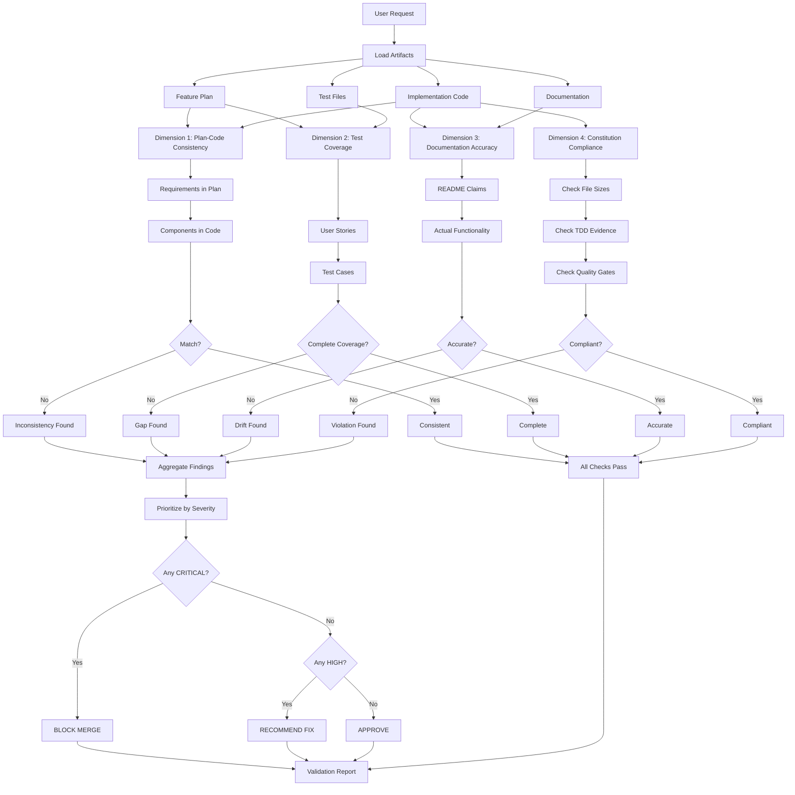

# Validation Command

Perform comprehensive cross-artifact analysis to detect inconsistencies between plans, code, tests, and documentation. Catch drift early before it becomes technical debt.

Perfect for pre-PR validation, verifying feature completeness, and maintaining documentation accuracy.

## What This Does

This command performs 4-dimensional validation:

- **Plan-Code Consistency** - Feature plans match actual implementation
- **Test Coverage Traceability** - Requirements have corresponding tests
- **Documentation Accuracy** - READMEs and comments reflect actual behavior
- **Quality Standards Compliance** - Constitution articles followed

**Key Features:**
- ✅ **Cross-Artifact Analysis** - Validates relationships between multiple artifacts
- ✅ **Requirement Traceability** - Maps user stories → code → tests
- ✅ **Drift Detection** - Finds where code diverged from plans
- ✅ **Gap Identification** - Discovers missing tests, undocumented features
- ✅ **Constitution Compliance** - Checks adherence to development principles
- ✅ **Actionable Reports** - Not just problems, but specific fixes needed

## When to Use

Use `/validate` when you need to:

- **Before Pull Request** - Ensure everything is consistent before review
- **After Feature Complete** - Verify implementation matches plan
- **Suspect Drift** - Code feels inconsistent with documentation
- **Pre-Production** - Final consistency check before deployment
- **After Refactoring** - Ensure docs and tests still accurate
- **Quality Audit** - Periodic check for accumulated drift

**Don't use when:**
- Building features (use `/feature-build` - includes quality gates)
- Fixing bugs (use `/bug-fix` - includes verification)
- Code review only (use `/review` for quality/security analysis)

## Workflow

### Workflow Visualization



### Dimension 1: Plan-Code Consistency

**Goal:** Verify implementation matches feature plan

**Validation Checks:**

1. **Requirements Mapping**
   ```
   For each requirement in feature plan:
     - Find corresponding code implementation
     - Verify all acceptance criteria met
     - Check edge cases handled
   ```

2. **Component Completeness**
   ```
   For each planned component:
     - Verify file exists
     - Check implements specified methods
     - Validate follows architecture decisions
   ```

3. **API Contract Adherence**
   ```
   For each planned API endpoint:
     - Verify endpoint exists
     - Check request format matches
     - Verify response format matches
     - Validate error codes as specified
   ```

4. **Data Model Consistency**
   ```
   For each planned schema:
     - Verify model/table exists
     - Check all fields present
     - Validate constraints match
     - Verify indexes created
   ```

**Example Output:**
```markdown
### Plan-Code Consistency: 85% Match

**CRITICAL Issues (Must Fix):**
- [C-001] Feature plan specifies JWT refresh tokens, but not implemented
  - Plan: `.claude/docs/checklist-auth.md` line 45
  - Missing: No refresh token endpoint in `src/routes/auth.ts`
  - Fix: Add `POST /api/auth/refresh` endpoint

**HIGH Issues (Should Fix):**
- [H-001] Planned component `AuthMiddleware` has different interface
  - Plan: Method `verifyToken(req) → User`
  - Code: Method `verifyToken(token) → Promise<User>`
  - Fix: Update plan or align code

**MEDIUM Issues (Consider):**
- [M-001] Plan mentions Redis caching, implementation uses in-memory
  - Plan: "Use Redis for session storage"
  - Code: `src/cache.ts` uses `new Map()`
  - Impact: Won't scale horizontally
```

---

### Dimension 2: Test Coverage Traceability

**Goal:** Every requirement has corresponding tests

**Validation Checks:**

1. **User Story → Test Mapping**
   ```
   For each user story:
     - Find test files that validate story
     - Check acceptance criteria have assertions
     - Verify both happy and error paths tested
   ```

2. **Edge Case Coverage**
   ```
   For each edge case in plan:
     - Find test that validates handling
     - Check error scenarios covered
     - Verify boundary conditions tested
   ```

3. **Coverage Gaps**
   ```
   For each requirement:
     - Calculate test coverage %
     - Identify untested paths
     - Flag critical gaps
   ```

4. **Test Quality**
   ```
   For each test:
     - Verify tests meaningful behavior (not just existence)
     - Check tests are deterministic
     - Validate tests would catch regressions
   ```

**Example Output:**
```markdown
### Test Coverage: 73% (Target: >80%)

**CRITICAL Gaps (Must Add Tests):**
- [C-002] User story AC-3 has no corresponding test
  - Story: "User can reset password via email"
  - Missing Test: No test for password reset flow
  - File: Should add to `tests/auth.test.ts`

**HIGH Gaps (Should Add Tests):**
- [H-002] Edge case "Concurrent registrations same email" not tested
  - Plan: Line 89 of checklist-auth.md
  - Missing: Race condition test
  - Fix: Add concurrent test in `tests/auth.concurrency.test.ts`

**MEDIUM Gaps:**
- [M-002] Performance requirement not validated
  - Plan: "Login should complete in <100ms with 1000 users"
  - Missing: Load test
  - Fix: Add to `tests/performance/auth.perf.test.ts`
```

---

### Dimension 3: Documentation Accuracy

**Goal:** Documentation reflects actual behavior

**Validation Checks:**

1. **README Claims**
   ```
   For each feature listed in README:
     - Verify feature actually exists
     - Check examples still work
     - Validate configuration instructions accurate
   ```

2. **API Documentation**
   ```
   For each documented endpoint:
     - Verify endpoint exists
     - Check parameters match
     - Validate response examples accurate
     - Test error codes documented
   ```

3. **Code Comments**
   ```
   For comments describing behavior:
     - Check code actually does what comment says
     - Flag outdated comments
     - Find contradictions
   ```

4. **Examples & Tutorials**
   ```
   For each example:
     - Test example code runs
     - Verify output matches documentation
     - Check dependencies current
   ```

**Example Output:**
```markdown
### Documentation Accuracy: 92% Accurate

**HIGH Issues (Update Docs):**
- [H-003] API endpoint documented but returns 404
  - Doc: `POST /api/users` in `docs/API.md`
  - Reality: Endpoint returns 404
  - Fix: Remove from docs or implement endpoint

- [H-004] README claims WCAG AA, but accessibility scan shows violations
  - Claim: "Fully accessible (WCAG 2.1 AA)"
  - Reality: 3 critical violations found by /review
  - Fix: Fix violations or update README

**MEDIUM Issues:**
- [M-003] Example code uses deprecated API
  - Doc: `examples/quick-start.md` line 23
  - Uses: Old `authenticate()` API
  - Current: `authenticateUser()` API
  - Fix: Update example
```

---

### Dimension 4: Quality Standards Compliance

**Goal:** Code follows Development Constitution

**Validation Checks:**

1. **Article I: TDD Enforcement**
   ```
   - Check test files have commit timestamps BEFORE implementation
   - Verify tests exist for all production code
   - Calculate coverage (must be >80%)
   ```

2. **Article II: File Size Limits**
   ```
   - Scan all files for size violations
   - Components > 200 lines → Flag
   - Services > 400 lines → Flag
   - Tests > 300 lines → Flag
   ```

3. **Article III: Progressive Quality Gates**
   ```
   - Verify feature plan exists (Phase 1 gate)
   - Check implementation follows plan (Phase 2 gate)
   - Validate tests pass (Phase 3 gate)
   ```

4. **Article IV: Production-Ready Only**
   ```
   - Search for: TODO, FIXME, HACK, XXX, console.log, debugger
   - Flag incomplete implementations
   - Check all error paths handled
   ```

5. **Article V: Multi-Dimensional Review**
   ```
   - Check if /review was run
   - Verify critical issues addressed
   - Validate no blocking security issues
   ```

6. **Article VII: Production-First UI**
   ```
   - Check accessibility compliance (ARIA, keyboard nav)
   - Verify responsive design
   - Validate loading/error states
   ```

**Example Output:**
```markdown
### Constitution Compliance: 2 Violations

**HIGH Issues (Fix Required):**
- [H-005] Article II Violation: 2 files exceed size limits
  - `src/components/Dashboard.tsx`: 247 lines (limit: 200)
  - `src/services/user.service.ts`: 456 lines (limit: 400)
  - Fix: Split files into smaller modules

**MEDIUM Issues:**
- [M-004] Article IV Violation: Debug code in commit
  - `src/utils/debug.ts`: Contains 12 console.log statements
  - Fix: Remove debug code before merge

**LOW Issues:**
- [L-001] Comment says "temporary solution" from 3 months ago
  - `src/cache.ts` line 34
  - Consider: Make permanent or remove
```

---

## Validation Report Format

After analyzing all dimensions, generate comprehensive report:

```markdown
# Validation Report

**Generated:** 2025-10-23 14:23:15
**Scope:** src/features/auth/
**Status:** ⚠️ CONCERNS (2 CRITICAL, 3 HIGH, 4 MEDIUM, 1 LOW)

---

## Executive Summary

- **Plan-Code Consistency:** 85% match (3 issues)
- **Test Coverage:** 73% (target >80%, 3 gaps)
- **Documentation Accuracy:** 92% (2 issues)
- **Constitution Compliance:** 2 violations

**Recommendation:** RECOMMEND FIX (address CRITICAL and HIGH issues before merge)

---

## CRITICAL Issues (Must Fix)

### [C-001] Missing JWT Refresh Tokens
- **Dimension:** Plan-Code Consistency
- **Severity:** CRITICAL
- **Evidence:** 
  - Plan: `.claude/docs/checklist-auth.md` line 45 specifies refresh tokens
  - Code: No refresh endpoint in `src/routes/auth.ts`
- **Impact:** Users will be logged out every 24h (poor UX)
- **Fix:** Add `POST /api/auth/refresh` endpoint per plan
- **Estimated Effort:** 1-2 hours

### [C-002] Untested Password Reset Flow
- **Dimension:** Test Coverage
- **Severity:** CRITICAL
- **Evidence:**
  - Story: "User can reset password via email" (AC-3)
  - Tests: No test file found for password reset
- **Impact:** Password reset could break undetected
- **Fix:** Add tests in `tests/auth/password-reset.test.ts`
- **Estimated Effort:** 30 minutes

---

## HIGH Issues (Should Fix)

[List all HIGH issues with same detail...]

---

## MEDIUM Issues (Consider)

[List MEDIUM issues...]

---

## LOW Issues (Informational)

[List LOW issues...]

---

## Summary Statistics

| Dimension | Total Checks | Passed | Failed | Pass Rate |
|-----------|--------------|--------|--------|-----------|
| Plan-Code Consistency | 20 | 17 | 3 | 85% |
| Test Coverage | 15 | 11 | 4 | 73% |
| Documentation Accuracy | 25 | 23 | 2 | 92% |
| Constitution Compliance | 10 | 8 | 2 | 80% |
| **TOTAL** | **70** | **59** | **11** | **84%** |

---

## Next Steps

**Immediate:**
1. Fix [C-001]: Add refresh token endpoint (1-2 hours)
2. Fix [C-002]: Add password reset tests (30 min)

**Before Merge:**
3. Fix [H-003]: Remove undocumented API endpoint
4. Fix [H-004]: Update README accessibility claim
5. Fix [H-005]: Split oversized files

**Follow-up:**
6. Address MEDIUM issues in next sprint
7. Monitor LOW issues for trends

---

## Validation Details

[Complete trace of all checks performed, artifacts analyzed, evidence gathered]
```

---

## Best Practices

### When to Validate

1. **Before Every PR** - Catch drift early
2. **After Feature Complete** - Verify everything consistent
3. **Pre-Production** - Final consistency check
4. **Monthly Audits** - Prevent accumulated drift

### What to Validate

**Always Validate:**
- Feature implementations (vs plans)
- Test coverage (vs requirements)
- API documentation (vs endpoints)
- Constitution compliance

**Optionally Validate:**
- Performance benchmarks
- Security scan results
- Accessibility compliance

### How to Fix Issues

**CRITICAL Issues:**
- Block merge until fixed
- Address immediately
- Revalidate after fix

**HIGH Issues:**
- Fix before merge
- May merge with plan to fix
- Track in backlog

**MEDIUM Issues:**
- Address in follow-up
- Don't block merge
- Monitor trends

**LOW Issues:**
- Fix if easy
- Document and accept otherwise
- Review in quarterly audit

---

## Common Issues & Solutions

### Issue: "Feature plan not found"

**Problem:** No plan file exists for feature

**Solutions:**
1. Create plan retroactively with `/feature-plan`
2. Document implementation in `.claude/docs/`
3. Skip plan-code validation for this feature

---

### Issue: "Test coverage below 80%"

**Problem:** Tests don't cover all code paths

**Solutions:**
1. Identify untested paths from coverage report
2. Add tests for critical paths first
3. Use `coverage` tool to find gaps
4. Consider if some paths untestable (document why)

---

### Issue: "Documentation drift detected"

**Problem:** Docs don't match implementation

**Solutions:**
1. Update docs to match code (if code is correct)
2. Fix code to match docs (if docs are correct)
3. Clarify intent (was this intentional change?)

---

### Issue: "Constitution violation"

**Problem:** Code doesn't follow development principles

**Solutions:**
1. Fix violation (refactor, add tests, split files)
2. Document exception (if legitimate reason)
3. Request constitution amendment (if principle wrong)

---

## Tips for Clean Validation

### 1. Validate Early & Often
Don't wait until PR. Validate after each major change.

### 2. Fix Immediately
Don't accumulate drift. Fix issues as they're found.

### 3. Track Trends
If same issue recurring, fix root cause (tooling, process).

### 4. Automate
Add validation to CI/CD pipeline for automatic checks.

### 5. Celebrate Clean Reports
Recognize teams with high validation scores.

---

## Anti-Patterns to Avoid

### ❌ Validating Too Late
```
Implementation complete → PR open → Validation finds issues
→ Major rework needed → Delays merge
```

**Better:** Validate continuously during development

### ❌ Ignoring MEDIUM Issues
```
"It's only MEDIUM, we'll fix later"
→ Accumulate 50 MEDIUM issues
→ Becomes unmaintainable
```

**Better:** Fix MEDIUM issues within 1-2 sprints

### ❌ Documentation as Afterthought
```
Code complete → "I'll update docs later"
→ Docs never updated
→ Validation always shows drift
```

**Better:** Update docs with code changes

---

## Remember

**Clean validation = Quality codebase**

- ✅ Plan-Code consistency prevents surprises
- ✅ Test coverage prevents regressions
- ✅ Doc accuracy prevents confusion
- ✅ Constitution compliance maintains quality

**Validation saves time:**
- 5 minutes validation → Hours of debugging prevented
- Early drift detection → Days of rework prevented
- Regular validation → Technical debt prevented

**Strive for 95%+ validation pass rate across all dimensions** ✨

