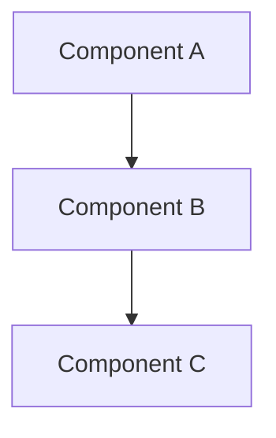

# Quick Default Plan Template

**Use this for Phase 0a to present intelligent defaults for user validation**

## Purpose

Generate a minimal 500-line plan with intelligent defaults to avoid wasting 120k tokens on wrong assumptions.

---

## Template Structure

```markdown
# [Feature Name] - Quick Default Plan

## Overview
[2-3 sentence summary of what we're building]

---

## Core Requirements (What We Know From User Message)

**Explicitly stated:**
- [Requirement 1 from user's message]
- [Requirement 2 from user's message]
- [Requirement 3 from user's message]

**Inferred:**
- [Requirement 4 inferred from context]
- [Requirement 5 inferred from domain]

---

## Intelligent Defaults (⚠️ FOR YOUR REVIEW)

I've made these assumptions while planning. **Please validate before proceeding:**

### 1. [Major Decision Area]
**Default:** [Choice made]
**Rationale:** [Why this default]
**Alternatives:** [Other options: X, Y]

### 2. [Major Decision Area]
**Default:** [Choice made]
**Rationale:** [Why this default]
**Alternatives:** [Other options: X, Y]

### 3. [Major Decision Area]
**Default:** [Choice made]
**Rationale:** [Why this default]
**Alternatives:** [Other options: X, Y]

[Continue for 5-7 major assumptions]

---

## Quick Architecture

**High-level design:**



**Key components:**
1. **[Component 1]** - [Responsibility] (~[X] lines)
2. **[Component 2]** - [Responsibility] (~[X] lines)
3. **[Component 3]** - [Responsibility] (~[X] lines)

---

## Estimated Scope

**Files:**
- CREATE: [X] files (~[Y] lines)
- MODIFY: [Z] files
- DELETE: None

**Total LOC:** ~[estimate] lines

**Complexity:** [X]/5

**Time Estimate:** [Z] hours

---

## Top 3 Risks

1. **[Risk 1]** (Probability: [1-3], Impact: [1-3])
   - Mitigation: [Quick mitigation approach]

2. **[Risk 2]** (Probability: [1-3], Impact: [1-3])
   - Mitigation: [Quick mitigation approach]

3. **[Risk 3]** (Probability: [1-3], Impact: [1-3])
   - Mitigation: [Quick mitigation approach]

---

## Technology Stack (Defaults)

**Backend:** [Based on existing codebase or popular choice]
**Frontend:** [If applicable, based on context]
**Database:** MongoDB (user preference)
**Testing:** Jest/Vitest (based on project)

---

## YOUR DECISION REQUIRED

I've created this quick plan with intelligent defaults based on common patterns and your stated preferences.

### OPTIONS:

#### (a) PROCEED with these defaults
- **Next:** Continue to comprehensive 7-phase planning
- **Time:** +20-30 minutes
- **Tokens:** +30k tokens
- **Result:** Detailed plan with architecture, risks, rollback, deployment

**Choose this if:** Defaults look reasonable, want comprehensive systematic planning

---

#### (b) CUSTOMIZE assumptions
- **Next:** I'll ask targeted clarifying questions (5-10 questions)
- **Time:** +30-40 minutes (questions + refined plan)
- **Tokens:** +40k tokens (questions 5k + refined plan 35k)
- **Result:** Plan customized to your exact preferences

**Choose this if:** Want different choices for OAuth, token expiry, deployment, etc.

**I'll ask about:**
- OAuth needed in v1?
- Email verification required?
- Token expiry times
- Deployment environment
- [Other major decisions]

---

#### (c) MANUAL planning
- **Next:** I'll provide quick implementation guidance and library recommendations
- **Time:** 5-10 minutes
- **Tokens:** +2k tokens
- **Result:** Quick guidance, you implement manually

**Choose this if:**
- Want to iterate fast
- Token budget constrained
- Comfortable implementing without comprehensive plan

---


---

## What Do You Choose?

Reply with:
- **(a)** to proceed with defaults (comprehensive planning)
- **(b)** to customize (I'll ask clarifying questions)
- **(c)** for manual (quick guidance and stop)
```

---

## Intelligent Defaults Library

### Common Defaults by Feature Type

**Authentication:**
- OAuth: No (defer to v2)
- Email verification: No (defer to v2)
- Password reset: No (defer to v2)
- Token expiry: 15min access, 7-day refresh
- Storage: httpOnly cookies (web), secure storage (mobile)
- Hashing: bcrypt cost 12

**API Design:**
- REST (unless GraphQL mentioned)
- JSON responses
- HTTP status codes (200, 400, 401, 403, 404, 500)
- Pagination: Offset-based (unless mentioned)
- Rate limiting: 100 req/15min (general), 5 req/15min (auth)

**Database:**
- MongoDB (user preference)
- Mongoose for validation
- Indexes on frequently queried fields

**Testing:**
- Jest/Vitest (based on package.json)
- >80% coverage target
- Unit + integration tests

**Deployment:**
- Staged rollout (canary → partial → full)
- Feature flags for rollback
- Monitoring dashboards

---

## When to Customize vs Use Defaults

**Use defaults if:**
- Feature is standard (authentication, CRUD, etc.)
- No special requirements mentioned
- Defaults are industry best practices

**Customize if:**
- Specific requirements stated ("must support OAuth")
- Non-standard deployment (on-prem, air-gapped)
- Regulated industry (healthcare, finance)
- Unusual constraints

---

## Remember

The goal of Phase 0a is to:
1. **Show the user what we're planning** before spending 120k tokens
2. **Get validation on major assumptions** early
3. **Offer escape hatch** (option c) if user realizes comprehensive planning not needed

**This prevents the "I just needed OAuth added, why did you plan multi-tenancy?" problem.**

**Present defaults clearly, wait for user choice, proceed based on their decision.**

